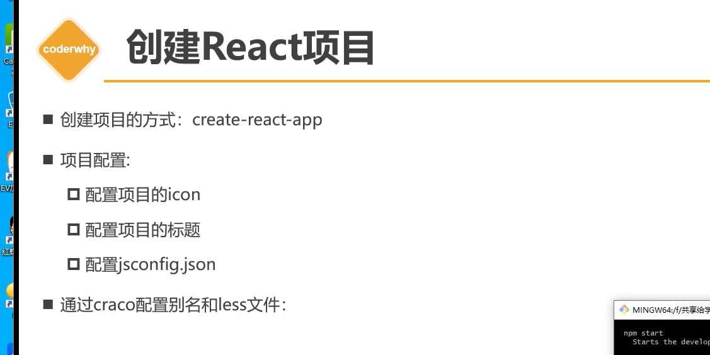
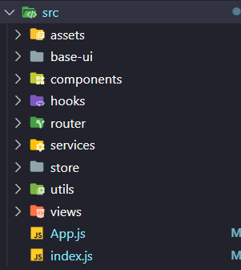

# reaact-project 项目实战

  1.1 搭建项目骨架




  2.1 配置项目别名

```js
    1 方案1 暴露 webconfig 配置 
        npm run eject

    2 方案2 craco => create-react-app config
        会将自定义配置和webconfig的配置进行合并
        npm install @craco/craco@alpha -D

        1) 创建文件夹 craco.config.js
            const path = require("path")
            const resolve = pathname => path.resolve(__dirname, pathname)
            module.exports = {
                // webpack
                webpack: {
                    alias: {
                        "@": resolve("src"),
                        "components": resolve("src/components"),
                        "utils": resolve("src/utils")
                    }
                }
            }

        2) 修改 package.json 的script脚本
            "scripts": {
                "start": "craco start",
                "build": "craco build",
                "test": "craco test",
                "eject": "react-scripts eject"
            }
     
```

  3.1 craco 配置less

```js
    1 安装
        npm i craco-less@2.1.0-alpha.0

    2 craco.config.js 进行引入使用
        const resolve = pathname => path.resolve(__dirname, pathname)
        module.exports = {
            plugins: [
                {
                    plugin: CracoLessPlugin
                }
            ],
        }
```

  4.1 Css样式的重置

```js
    1 npm install normalize.css
    2 import "normalize.css"
```

  5.1 全家桶-router的配置

```js
    1 npm install react-router-dom
```

  5.2 全家桶-redux状态管理

```js
    npm install @reduxjs/toolkit react-redux
```

  6.1 axios 的配置

```js
    npm install axios
```

  7.1 CSS-IN-JS 封装

```js
    npm install styled-components
```

## 集成 UI 组件库

  1.1 react 集成 ant-design

```js
    npm install antd --save
```
  
  2.1 react 集成 Material UI

```js
    npm install @mui/material @emotion/react @emotion/styled
    npm install @mui/material @mui/styled-engine-sc styled-components
```

## 集成 classnames 方便动态集成classname

```js
  npm install classnames
```

## 集成动画  react-transition-group

```js
  npm install react-transition-group
```

## 集成 防抖节流库

```js
  npm install underscore
```
